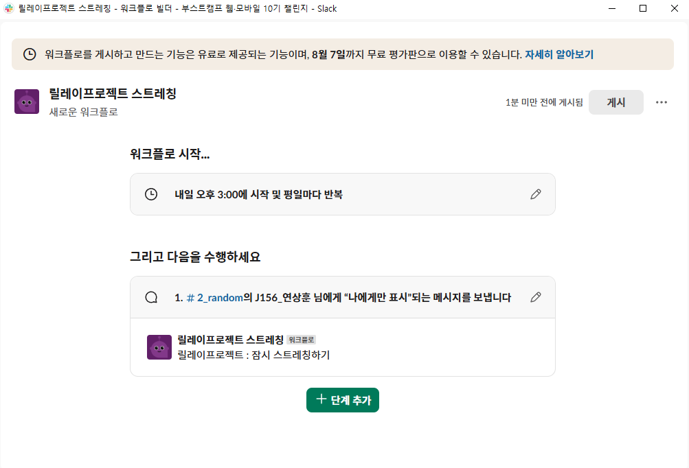

# WEEK1

# 🎮 팀 이름 또는 퀘스트 노트 이름

> 🧠 **힘든 미션 속에서도 재밌게 웃을 시간 하나 만들자 !**
> 

---

## 📚 1. 토론 및 조사 내용

### 🤯 챌린지를 하며 놓치고 있던 것 & 과하게 집중했던 것들

- ⌛ 구현에 쫓기다 보니, 공유하려면 **잠을 줄이는 수밖에** 😵‍💫
- 🧠 “학습”이 중요한데, 할애하는 시간이 너무 애매하다…
- ☕ 안 마시던 커피까지 마시고, 🏋 운동은 못 하고, 🖥 큰 모니터에 갇힌 삶...
- 😌 그래도 구현하고 나면 **뿌듯**은 하다!
- 🕵️ 각자 다른 거에 집중하는데, **커버 쳐주는** 팀워크는 굿! 💪
- ❓ 서로 모르는 건 질문하는데, 역시 공유가 핵심
- 🕐 회의 1시간은 짧다 vs 길다 → 팀 바이 팀
- 🧩 회의하고 완전한 피드백하기도 사실 2시간은 부족하다...
- 📝 체크포인트는 좀 더 **작고 구체적**하게 쪼개야 의미 있음
- 📄 체크포인트 학습 정리할 때 **배경지식** 적는 비중이 너무 적다
- 🧂 모든 게 주관적인데, 평균적으로 어느 정도 걸리는지는 궁금해...
- 🎯 미션 대주제를 주고, 나머지는 **능동적으로 공부**하는 방식이 좋은 듯!
- 📸 슬랙에 플리/사진 공유하는 루틴 생기니까 **자연스럽게 공유하게 됨**

### 🚀 개발자로서 학습하고 성장한다는 건?

- 💡 개발자가 되기로 한 이유?
    - 전공은 데이터였지만 웹 수업 듣고 너무 재밌어서 진로 변경! 🤸‍♀️
    - 자연스럽게 "이걸로 가보자!" 하게 됨
- ✍️ 성장하려면 **기록**이 정말 중요하다는 걸 요즘 진짜 체감 중...
- 📊 정량적인 스펙보단, **정성적인 고민**과 태도가 더 중요한 것 같다
- 🧟‍♂️ 개발자로서 살아남았다 = 성장했다
- 🏋️‍♀️ **개발은 근력 싸움이다!**
    - 자주 쓰는 지식은 강화되고, 안 쓰면 퇴화…
    - CS 지식도 “기술부채”처럼 관리가 필요함!

### 💡 이야기 했던 퀘스트 아이디어들

- 건강 관리 하기 위해 AI를 이용 ☑️
- AI에게 격려하는 말을 듣고 자신감 충전하기
- 오늘 미션과 관련된 CS지식을 가지고 면접 관련 질문 알려달라고 하기
- SUNO(AI음악작사작곡) 으로 미션 회고를 적어서 음악으로 만들기 ☑️
- README 작성 능력 향상 시키기 ☑️
- 팀원 분들의 정보를 각각 입력해서 만든 캐릭터들로 단체 사진 이미지 만들기(추억..) ☑️

---

## 🎯 2. 이번 주 퀘스트 소개

> ✨ 가볍고 재밌게, 하지만 뭔가 남는 걸 하자!
> 

---

## 🧩 퀘스트 목록

### 🧪 퀘스트 1: `건강 관리를 위해 슬랙 워크플로로 스트레칭 알람 사용하기`

- **목적**: 미션을 수행하며 끊기지 않고 몰입해서 집중하는 것도 좋지만 몸을 생각한다면 환기도 필요하다.
- **내용**: 매일 거북목으로 미션 수행하면서 굳어가는 어깨, 목, 허리.. 잊지 말고 한 번씩 풀어주자!
- **수행 과정**:
    1. 슬랙 채널에서 워크플로우 빌더 열기
    2. 새 워크플로우 만들기 → 이벤트 선택 → “일정에 따라” 선택
    
    

    
    3. 원하는 시간, 빈도 설정 (예: 매일 오후 3시)
    
    

    
    4. “메시지 보내기” 액션 추가 → 스트레칭 등 원하는 문구 입력
    5. 완료 후 저장하면 슬랙봇이 자동으로 알림 전송!
    
    

    
- **결과**:
    - 집중력에 속아 건강을 잃지 말지 않을 수 있다!

---

### 🎯 퀘스트 2: 📷 `피어 피드백 팀 가족사진 만들기`

- **목적**: 매번 바뀌는 피어 피드백 팀.. 잊지 말고 기억할 수 있게 가족사진
- **내용**: 각 팀원들의 특징에 따라 만들어진 캐릭터들로 가족 사진 이미지를 만들어보자
- **수행 과정**:
    - 각 팀원들의 이름과 특징 3가지를 정리한다.
    - 가족사진 분위기와 배경을 정리한다.
    - 이후 추가로 작성할 정보를 정리한다.
    - [뤼튼](https://wrtn.ai/) AI에 접속한다.
    - 도구 → 이미지 제작 클릭

       

    - 프롬프트에 관련 정보를 전달하고 팀 가족사진을 만들어달라고 요청한다.
        
        

        
    - 나온 이미지를 저장한다. 가능하다면 슬랙에 공유한다!
        
        
        
- **결과**:
    - AI로 우리
    - 우리가 더 똑똑해진 느낌!! 🧠✨

---

### 🧩 퀘스트 3: `미션 회고로 작사/작곡하기 : SUNO AI 사용`

- **목적**: 미션 회고와 관련된 나만의 노래를 들으면서 재밌게 다음 미션을 수행해보자
- **내용**: SUNO AI에서 가사와 음악 스타일을 프롬프트로 작성하여 작사/작곡해보기
- **수행 과정**:
    
    https://suno.com/
    
    - 좌측 메뉴 중 **Create** 로 이동
    
    

    
    - 가사 프롬프트 :  미션 회고 또는 슬랙에 있는 사람들의 미션 회고를 자유롭게 작성한다.
    - 음악 스타일 프롬프트 : 현재 본인의 기분을 반영한 음악 스타일을 작성한다.
    - 만들어진 노래의 링크를 꼭 **슬랙에 첨부**한다 !
        
        ⇒ 예시 링크 : https://suno.com/s/qo6XDiT4WJMHmE2K
        
        들어가서 한번 들어보세요 생각보다 고퀄이고 웃깁니다 ..
        
- **결과**:
    - 다른 사람이 만든 노래를 듣고 위로도 받고, 웃을 수 있다 🎶

---

### 🎯 퀘스트 4: README 작성 능력 향상 시키기

- **목적**: 문서 작성 능력을 향상 시키기 위해 잘 작성된 문서의 구조를 파악하기 💬
- **내용**: 동료의 README의 구조를 AI를 이용하여 분석을 해본다.
- **수행 과정**:
    - 피어 피드백 종료 후 잘 정리되었다고 생각하는 동료의 gist 문서를 AI에게 전달한다.
    - 프롬프트: “이 글의 전체적인 구성 구조를 분석해줘. 이 글의 전개 흐름, 단락별 역할, 화술 기법을 체계적으로 정리해서 내가 다음에 글을 쓸 때 템플릿으로 참고할 수 있게 해줘.”
    - 어떤 동료의 README를 참고했는지 알려준다.
- **결과**:
    
    

   

    

   

## 3. 🤝 미션 이어받기

| 이름  | 실천할 퀘스트                                                                 | 선정 이유                                                                                                                                                    |
|-------|--------------------------------------------------------------------------------|---------------------------------------------------------------------------------------------------------------------------------------------------------------|
| j156  | 건강 관리를 위해 슬랙 워크플로로 스트레칭 알람 사용하기                      | 평소에도 너무 깊게 집중해서 많기 때문에 중간중간 의도적으로라도 집중을 끊고 현 상태를 점검할 필요가 있기 때문에                                               |
| S037  | - 피어 피드백 팀 가족사진 만들기 - 미션 회고로 작사/작곡하기             | - 나와 같이 열심히 무언가를 한 사람들을 기억하고 싶기에 - 노래로 너무 조용한 환경을 잠깐이나마 환기시키고 싶음                                             |
| J234  | - 스트레칭 알람 사용하기 - 미션 회고로 작사/작곡하기                      | - 몸을 계속해서 신경쓰는 것이 중요하기 때문에 선택 - 다양한 방식으로 AI를 사용해보고 싶은데, 특히 작곡은 색다른 경험이 될 것 같음 + 동료들을 노래로 응원하고 싶음 |
| J188  | - 피어피드백 팀 가족사진 만들기 - 미션 회고로 작사/작곡하기 (SUNO AI)    | 두 퀘스트 모두 너무 재밌는 아이디어라서 흥미가 생겼음. AI를 이렇게 활용할 수 있다는 점이 신선하고, 평소 생각해보지 못한 방식이라 꼭 시도해보고 싶음! 단순한 기능 학습이 아닌, 창의적이고 즐거운 경험이 될 것 같음. |

## 4. 실천하기

| 이름  | 월 | 화 | 수 | 목 | 금 |
|-------|---|---|---|---|---|
| j156  | V | V |   |   |   |
| S037  |    |   | V |   |   |
| J234  |    |   |   |   |   |
| J188  |    |   |   |   |   |

### 4-1. 실천 이미지 첨부

- j156 
    - 
    - 알람은 안 울렸지만, 스스로 알아서 했습니다. 알람이 안 울리는 원인은 나중에 여유 있으면 알아봐야겠네요
    - 설명대로 해봐도 영 모르겠습니다.

- S037
    - 이미지 대신 링크로 https://boostcampwm10-ch.slack.com/archives/C095HM7NE81/p1753243744386069

